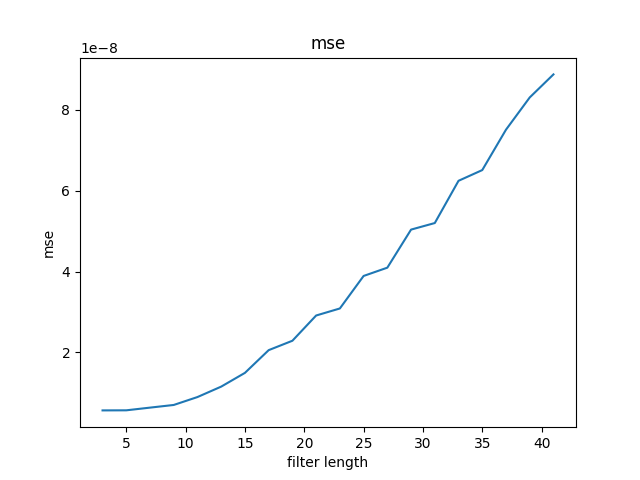
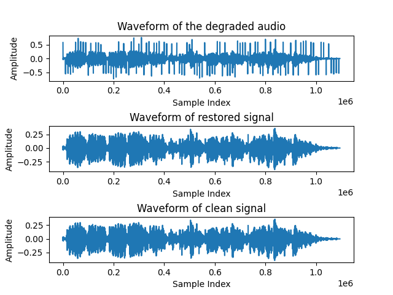
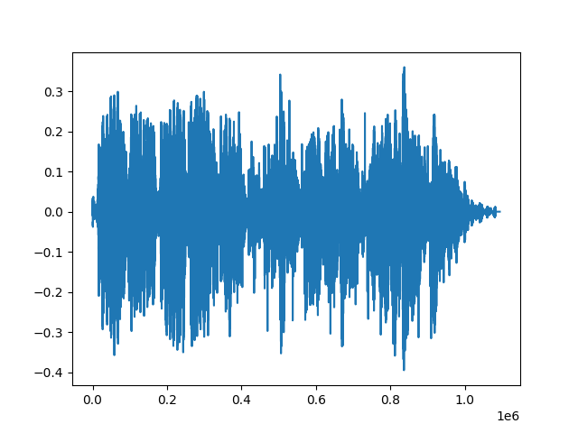

# Two methods to Audio Restoration Assignment (Median Filter and Cubic Splines Interpolation)

## High-level Description of the project
This assignment builds on Assignment I. We assume that we have successfully detected the clicks and we are applying different interpolation methods to restore the audio, such as
- median filtering
- cubic splines

I have created a median filter which produces the same output as the median filter in the numpy library. In addition, I have compared the execution time and output of median filters and cubic splines.

[Here](https://github.com/HaohanZhutcd/Computational_Method.git
) is a link to my github. PS: Choose 'master' branch.

---

## Installation and Execution

I used some libraries in this project, For other users are easier to review my work I will provide the versions and names of the libraries as follow:
```
matplotlib==3.6.2
numpy==1.23.5
scipy==1.9.3
tqdm==4.64.1
```

Run this command in shell to install the environment:
```
pip install -r requirements.txt 
```
For more details check [here](https://github.com/bndr/pipreqs)


---
## Introduction to the program files

"The main.py" file is the final file which includes the program of median filter and cubic splines, so run it can display the result directly.

"rw_audio.py" includes 3 functions which are to read, write audio file from sources and compare the results of clean, degraded, restored wave.

"detectionfile.py" is to detect the clicks in the degraded audio, and generate 0 and 1 to represent the place where has click.

"MeanSquaredError.py" is to calculate mse.

"medianFilter_detection.py" is the final version of median filter implementation.

"medianFilter.py" is the median filter without using numpy library

"medianFilter_test.py" is to test the output between my own function and numpy function

"Median_Execution.py" is to execute the Median filter (medianFilter_detection.py)

"CubicSplinesFilter.py" is the implementataion of Cubic Splines Interpolation

---

## Methodology and Results
Describe here how you have designed your code, e.g. a main script/routine that calls different functions, is the unittesting included in the main routine? 

I used indiviual file to write some functions to implementation the functions of the different sections. First I write function to read the audio file because I used scipy library to read the audio and in the way the audio data is a simple uncompressed WAV file. So I have to normalize the data. The functions of the individual files have been described in detail in the previous section and are described in the code.

For median filter, I create the filter window created by 3 steps firstly.
1. The first step is to distinguish between the first, end and middle sections of the data.
2. Different operations are performed according to the different parts, the first segment is padding 0s before the data, the end is padding 0s after the data and the middle part is operated normally without padding 0.
3. After creating the window, we sort the data within the window and replace the clicks with middle value.

For Cubic Splines Interpolation:
1. Detect the clicks
2. Delete the Data and Indices where have clicks
3. Execute the Cubic Splines Interpolation like (0, 1, 2, 3, 4) -> (0, 1, 3, 4)
4. Resume the data from Cubic Splines Interpolation

**Results**

1. For the median filter, different lengths were explored to test the effectiveness of the fix. In particular, filters with lengths ranging from 3 to 23 were tested and it was found that the MSE was lowest when the length was 3, as shown in Figure below.



figure 1: Relation between filter length and mse (optimal filter length = 3)

The restored waveform <clean.wav> with the optimal filter length is given below:



figure 2: Comparision between Clean, Degraded and Restored audio

2. Using the cubic splines, we observe that clicks were largely eliminated.

The restored waveform <CPI.wav> with the optimal filter length is given below:



figure 3: Output of Cubic Splines Interpolation

3. Comparing the two different interpolation methods, we notice that Cubic Spline Filter has a lower MSE than the Median filter with filter_size = 3. The runtime of median_filter and cubic spline interpolation showed as follow.


figure 4: Execute time and mse between Splines and Median

After listening to the two restored files, we note that both audios eliminate clicks and sound similar.


---
## Credits

This code was developed for purely academic purposes by Haohan Zhu (HaohanZhutcd) as part of Assignment 2 which named "Audio Restoration in Python" of the module (EEP55C22 - Computational Method) in the Trinity College Dublin  

---
## Resources
- Course materials from Dr.Angeliki Katsenou
- Python Spline Interpolation How-To (Online Resource):
  https://betterprogramming.pub/python-spline-interpolation-how-to-ef059c214d28
- SciPy documentation (Scipy.interpolate.CubicSpline):
  https://docs.scipy.org/doc/scipy/reference/generated/scipy.interpolate.CubicSpline.html

- my github: https://github.com/HaohanZhutcd/Computational_Method.git


